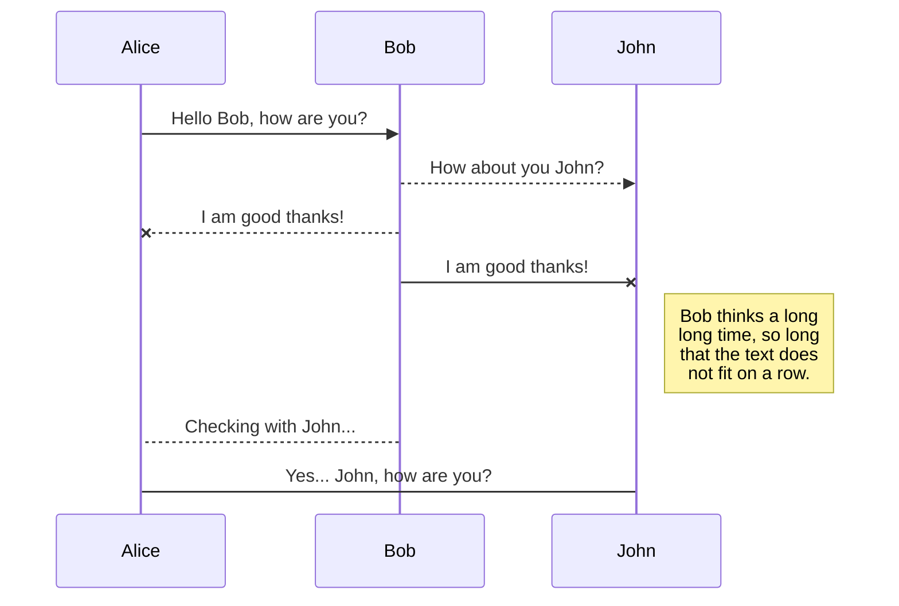
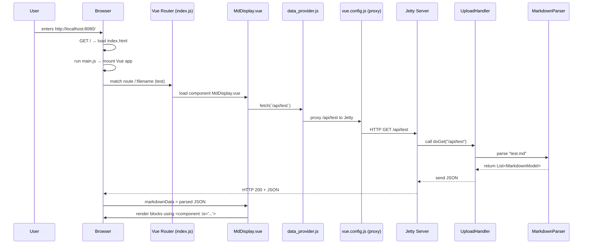

# Java Streams
This is about Java streams.

## 1. What is Java Streams
In Java, a Stream is a sequence of data that you can process in a declarative and functional style. It allows you to perform operations such as filtering, mapping, and reducing on a collection of data. Streams can be used with various data sources, including arrays, collections, and even I/O channels.
```java
public class HelloWorld {

    // Your program begins with a call to main().
    // Prints "Hello, World" to the terminal window.
    public static void main(String[] args)
    {
        System.out.println("Hello, World");
    }
}
```

## 2. This is sample heading 2
### 2.1 This is sample heading 3
This is sample text 2




