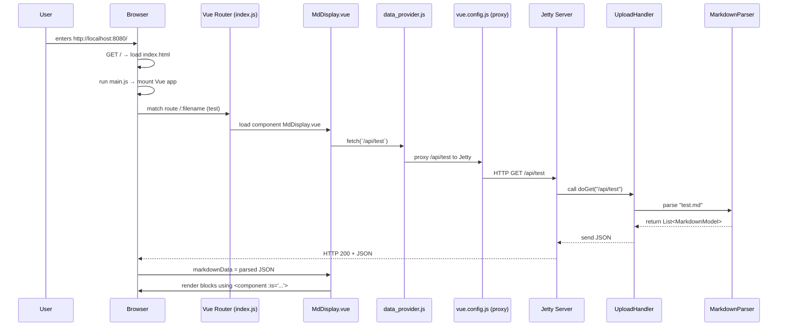

# Java Streams
This is about Java streams.

## 1. What is Java Streams
In Java, a Stream is a sequence of data that you can process in a declarative and functional style. It allows you to perform operations such as filtering, mapping, and reducing on a collection of data. Streams can be used with various data sources, including arrays, collections, and even I/O channels.
```java
public class HelloWorld {

    // Your program begins with a call to main().
    // Prints "Hello, World" to the terminal window.
    public static void main(String[] args)
    {
        System.out.println("Hello, World");
    }
}
```

## 2. This is sample heading 2
### 2.1 This is sample heading 3
This is sample javascript
```js
console.log("Hello, World!");
```

This is sample html
```xml
<!DOCTYPE html>
<html>
<body>

<h2>The href Attribute</h2>

<p>HTML links are defined with the a tag. The link address is specified in the href attribute:</p>

<a href="https://www.w3schools.com">Visit W3Schools</a>

</body>
</html>
```

This is sample css
```css
body {
  background-color: lightblue;
}

h1 {
  color: white;
  text-align: center;
}

p {
  font-family: verdana;
  font-size: 20px;
}
```

This is sample yaml
```yaml
---
 doe: "a deer, a female deer"
 ray: "a drop of golden sun"
 pi: 3.14159
 xmas: true
 french-hens: 3
 calling-birds:
   - huey
   - dewey
   - louie
   - fred
 xmas-fifth-day:
   calling-birds: four
   french-hens: 3
   golden-rings: 5
   partridges:
     count: 1
     location: "a pear tree"
   turtle-doves: two
```
This is sample json
```json
{
    "glossary": {
        "title": "example glossary",
		"GlossDiv": {
            "title": "S",
			"GlossList": {
                "GlossEntry": {
                    "ID": "SGML",
					"SortAs": "SGML",
					"GlossTerm": "Standard Generalized Markup Language",
					"Acronym": "SGML",
					"Abbrev": "ISO 8879:1986",
					"GlossDef": {
                        "para": "A meta-markup language, used to create markup languages such as DocBook.",
						"GlossSeeAlso": ["GML", "XML"]
                    },
					"GlossSee": "markup"
                }
            }
        }
    }
}
```

This is sample mermaid


To add a table, use three or more hyphens (---) to create each column’s header, and use pipes (|) to separate each column. For compatibility, you should also add a pipe on either end of the row.

| Syntax      | Description |
| ----------- | ----------- |
| Header      | Title       |
| Paragraph   | Text        |
as
- Sample list 2
- Sample list 1


| Item             | In Stock | Price |
| ---------------- |---------| ---- |
| Python Hat       |     True | 23.99 |
| SQL Hat          |     True | 23.99 |
| Codecademy Tee   |    False | 19.99 |
| Codecademy Hoodie |    False | 42.99 |